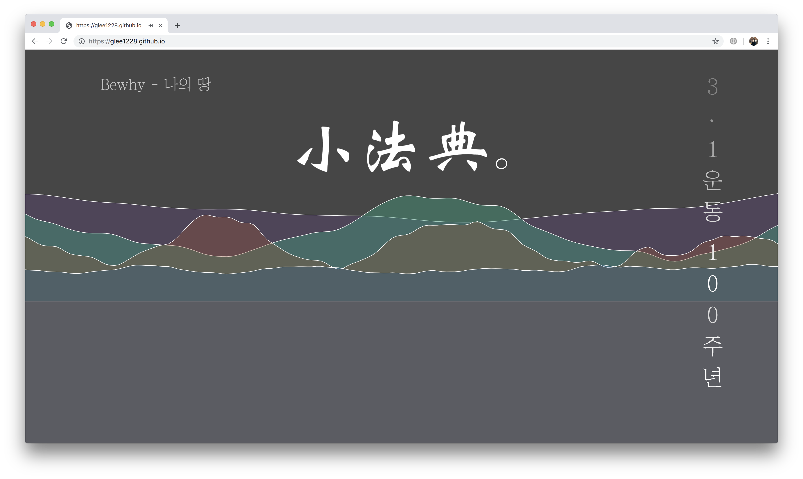

## Visual-Programming [역사를 그리다]
### by TEAM 소법전

- Sound Visualization Demo : [http://glee1228.github.io/](http://glee1228.github.io/)
- Historical flow Visualization Demo : [http://glee1228.github.io/animation.html](http://glee1228.github.io/animation.html)

## **스크린샷**
- [3.1 운동 100주년을 그리다](https://github.com/glee1228/glee1228.github.io/issues/1)

- [영화로 보는 한국 근현대사](https://github.com/glee1228/glee1228.github.io/issues/2)

